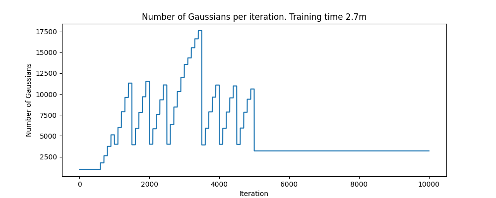
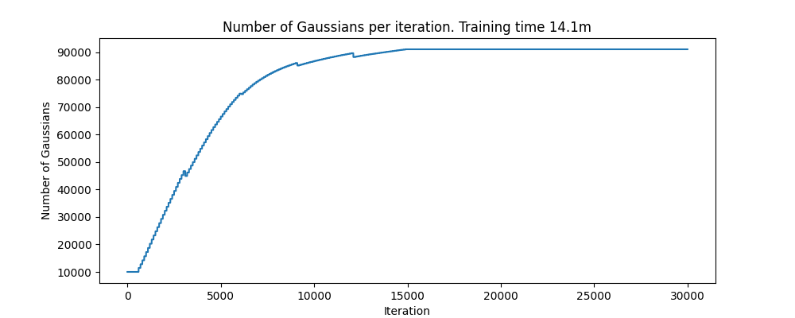

### Gaussian Splatting
[Gaussian Splatting](https://arxiv.org/abs/2308.04079) is a very powerful representation method of 3D geometry. Once the representation is optimized for a certain scene, it can be rendered from arbitrary viewpoints. To control the number of points, Kerbl et al. use density-based pruning, splitting, and cloning. Splitting and cloning are methods to create additional Gaussians to represent the geometry more accurately. Pruning is a method to remove Gaussians that are not necessary to represent the geometry by checking if the point's opacity is below a threshold. 

### Fix the number of points used in the scene
In this project, we utilize the opacity-based pruning method to give the user control over the number of points that are used to model the geometry. When setting this parameter to $4\,000$, the optimization times decreases significantly. And for simple ShapeNet scenes, the quality of the reconstructions does not suffer. In fact, we observed a 2% increase in PSNR, LPIPS, and SSIM when fixing the number of points to $4\,000$ instead of not exerting any control over the number of parameters. 

<table>
  <tr>
    <td align="center"></td>
    <td align="center"></td>
  </tr>
</table>

<table>
  <tr>
    <td align="center"></td>
  </tr>
</table>